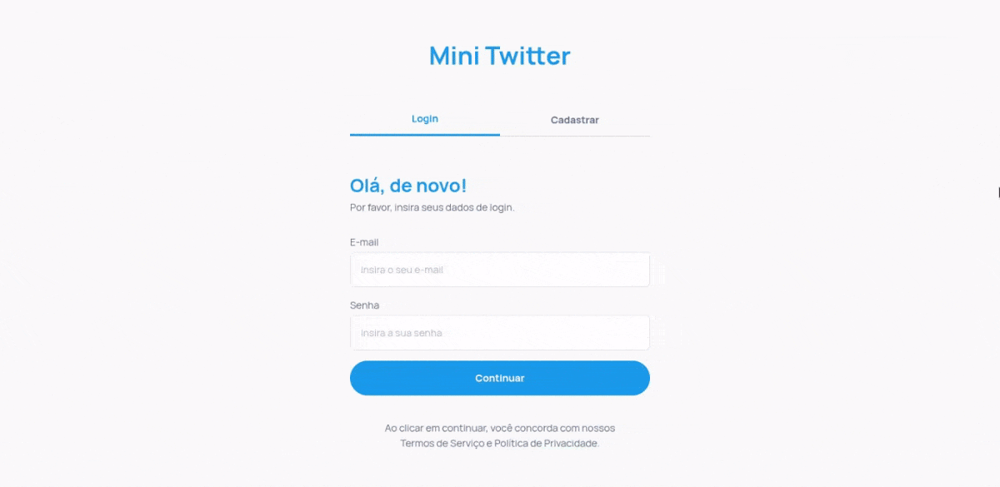

# 🐦 Mini-Twitter



Aplicação inspirada no Twitter com foco em **arquitetura de frontend, gerenciamento de estado e integração com API REST**.  
O backend atua como suporte, permitindo simular um cenário real de consumo de dados.

---

## 🎯 Objetivo

Este projeto foi desenvolvido para explorar, na prática:

- Organização escalável de aplicações React
- Gerenciamento eficiente de estado global
- Integração com APIs reais (autenticação + CRUD)
- Experiência de usuário em operações assíncronas

Não é apenas um clone visual — é um **exercício de construção de frontend orientado a dados e estado**.

---

## 🚀 Tecnologias Core

- **Framework:** React + Vite
- **Linguagem:** TypeScript
- **Estilização:** Tailwind CSS
- **Gerenciamento de Estado:** Zustand (com persistência)
- **Formulários & Validação:** React Hook Form + Zod
- **Requisições HTTP:** Axios

---

## 🧠 Decisões de Arquitetura

Algumas escolhas foram feitas intencionalmente:

- **Zustand ao invés de Redux**  
  Menor boilerplate e melhor legibilidade para estado global moderado

- **Separação por domínio (api, pages, components, store)**  
  Reduz acoplamento e facilita evolução do projeto

- **Zod para validação**  
  Tipagem consistente entre entrada de dados e regras de negócio

- **Camada de API isolada (`/api`)**  
  Evita espalhar lógica de requisição pela interface

---

## 📦 Estrutura do Projeto (Frontend)

```bash
src/
├── api/
├── components/
├── lib/
├── pages/
├── routes/
├── schemas/
├── store/
└── styles/
```

---

## 🔌 API REST (Backend)

O backend expõe uma API REST com autenticação via JWT e operações básicas de posts.

### 📄 Posts

| Método | Endpoint        | Descrição                       | Auth |
| ------ | --------------- | ------------------------------- | ---- |
| GET    | /posts          | Lista posts (paginação e busca) | ❌   |
| POST   | /posts          | Cria um novo post               | ✅   |
| PUT    | /posts/:id      | Atualiza um post                | ✅   |
| DELETE | /posts/:id      | Remove um post                  | ✅   |
| POST   | /posts/:id/like | Alterna like/unlike             | ✅   |

**Query params:**

- `page` (opcional)
- `search` (opcional)

---

### 🔐 Autenticação

| Método | Endpoint       | Descrição          | Auth |
| ------ | -------------- | ------------------ | ---- |
| POST   | /auth/register | Criação de usuário | ❌   |
| POST   | /auth/login    | Retorna JWT        | ❌   |
| POST   | /auth/logout   | Invalida sessão    | ✅   |

---

## ⚙️ Backend (Suporte)

O backend foi mantido **intencionalmente simples**, com o objetivo de:

- Simular um ambiente real de integração
- Fornecer endpoints REST claros
- Permitir foco no frontend

Ele não cobre cenários avançados de segurança ou arquitetura — atua como base funcional.

---

## 🛡️ Funcionalidades

- Autenticação com persistência de sessão
- Criação e listagem de posts
- Paginação de dados
- Validação de formulários
- Feedback com notificações (toast)
- Interface responsiva

---

## 🛠️ Como Executar

### 1. Clonar o repositório

```bash
git clone https://github.com/IsaacLira42/mini-twitter.git
cd mini-twitter
```

---

### 2. Rodar o backend (Docker)

```bash
cd backend
docker-compose up --build
```

---

### 3. Rodar o frontend

```bash
cd frontend
npm install
npm run dev
```

Crie um arquivo `.env` em `frontend/`:

```env
VITE_API_URL=http://localhost:3000
```

---

## ⚠️ Limitações conhecidas

- Autorização simplificada (sem controle avançado de permissões)
- Logout sem estratégia robusta de invalidação de tokens
- Validações backend básicas
- Paginação baseada em página (não cursor)

---

## 📌 Observações

Este projeto prioriza **clareza arquitetural e fluxo de dados no frontend**.
O backend existe como suporte funcional para esse cenário.

---

## 👤 Autor

**Isaac Lira**  
Desenvolvedor Full Stack | TypeScript Enthusiast

[](https://github.com/IsaacLira42)
[](https://linkedin.com/in/isaaclira42)
[](mailto:isaaclira422@gmail.com)
